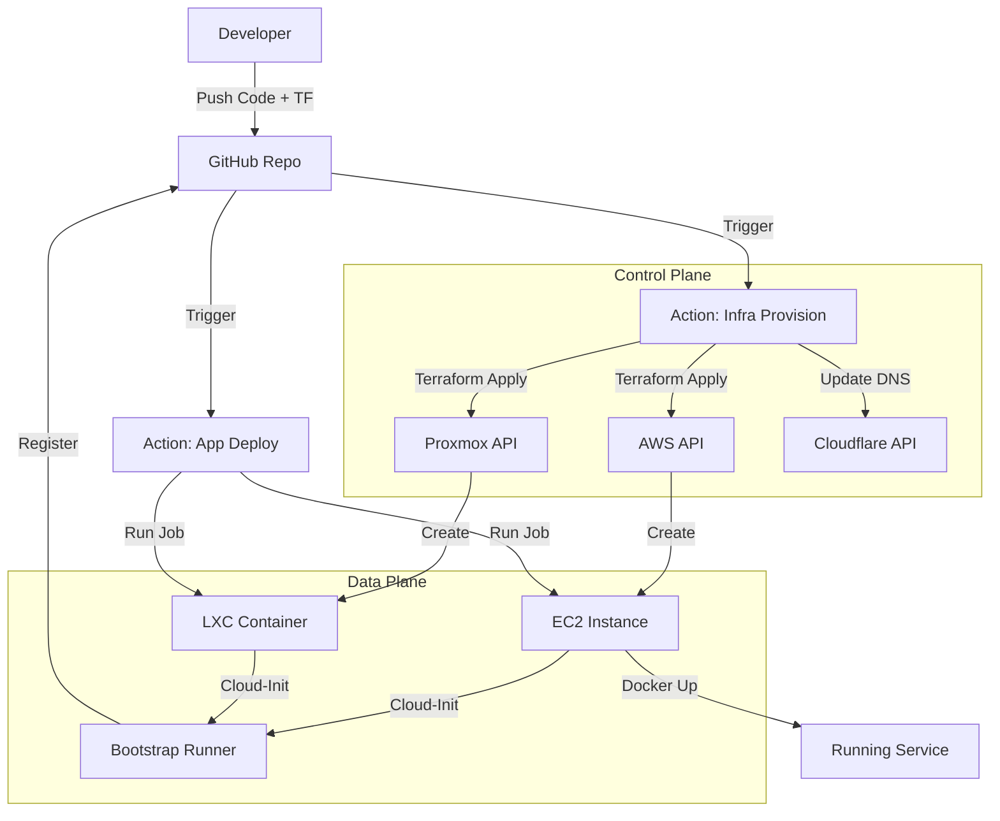

# Launch 🚀

**Self-Service Infrastructure Builder for Enterprise and Homelab**

Launch is a modern self-service infrastructure platform that enables zero-touch deployment of web services and MCP servers. By leveraging a monorepo architecture with Terraform, a single code check-in triggers the automated provisioning of infrastructure (VMs/LXCs on Proxmox or AWS), bootstrapping of runners, and deployment of application code. It unifies multi-cloud management into a single, standard developer experience.

**Disclaimer**
The use of AI was leveraged to help build diagrams, documentation, and some coding guidance. **All code has been written by Edward Hallam**

## �️ Architecture

## Goals & Objectives

### Primary Goals
1.  **One Code Check-in**: Pushing code + config triggers the entire chain: Provision Infra -> Bootstrap Runner -> Deploy App.
2.  **Infrastructure as Code (IaC)**: Terraform is the single source of truth for all infrastructure state.
3.  **Unified Developer Experience**: Same workflow for deploying to a local Proxmox LXC or a production AWS EC2 instance.
4.  **Zero-Touch Provisioning**: VMs boot, install their own runners, and register themselves without SSH intervention.
5.  **Automated Networking**: Public services automatically get DNS records (Cloudflare) and SSL.

### Success Metrics
- **Deployment Time**: < 10 minutes from "Git Push" to "Live URL".
- **Manual Steps**: 0 (after initial repo setup).
- **Cost**: Optimized via spot instances or homelab resources where appropriate.

### Technology Stack
- **IaC**: Terraform
- **CI/CD**: GitHub Actions
- **Compute**: AWS, GCP, Proxmox On-Prem
- **DNS**: Cloudflare
- **Containerization**: Docker, Docker Compose

