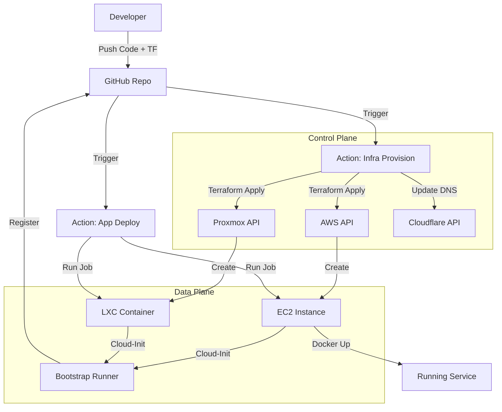

# Launch 🚀

**Service-Owned Infrastructure for Homelab & Cloud**

Launch is a "One Code Check-in" platform. You define your service and its infrastructure in code, push to GitHub, and the platform handles the rest: provisioning VMs, bootstrapping runners, and deploying your application.

## �️ Architecture

## 📚 Documentation

*   **[PRD](docs/PRD.md)**: Detailed architecture and requirements.
*   **[Setup Guide](docs/SETUP.md)**: How to bootstrap the platform initially.
*   **[Troubleshooting](docs/TROUBLESHOOTING.md)**: Common issues and fixes.

---
*Built with Terraform, GitHub Actions, Proxmox, and AWS.*
