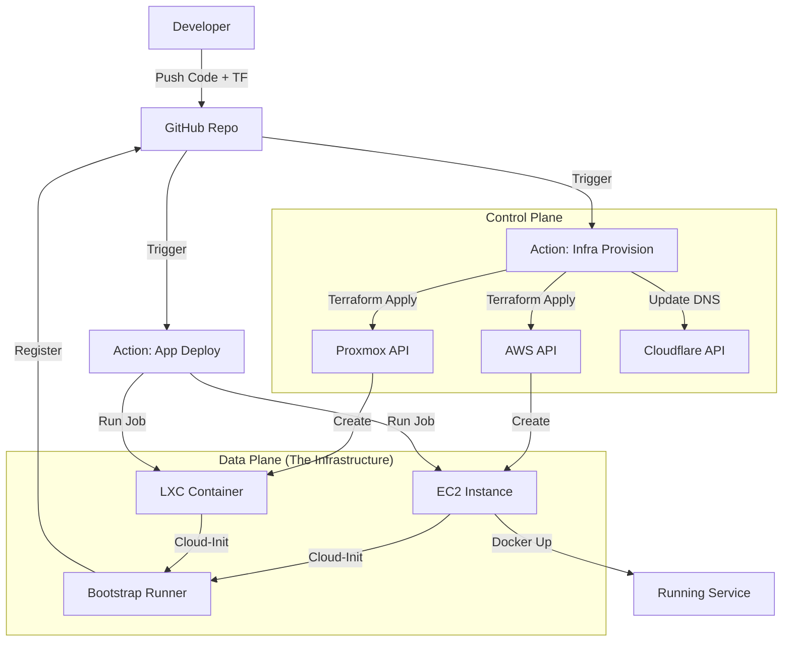

# Product Requirements Document: Launch

**Project Name:** Launch
**Version:** 2.0
**Date:** November 18, 2025
**Owner:** Eddie Hallam
**Status:** Phase 1 - Infrastructure as Code Foundation

## Executive Summary

Launch is a modern "Service-Owned Infrastructure" platform that enables zero-touch deployment of web services and MCP servers. By leveraging a Monorepo architecture with Terraform, a single code check-in triggers the automated provisioning of infrastructure (VMs/LXCs on Proxmox or AWS), bootstrapping of runners, and deployment of application code. It unifies multi-cloud management into a single, standard developer experience.

## Problem Statement

Current challenges:
- Manual provisioning of VMs and LXCs is slow and error-prone.
- "Drift" between defined infrastructure and actual state.
- Disconnected workflows for Infrastructure (Proxmox/AWS) and Application Code.
- Lack of a central registry for what is currently deployed.

## Goals & Objectives

### Primary Goals
1.  **One Code Check-in**: Pushing code + config triggers the entire chain: Provision Infra -> Bootstrap Runner -> Deploy App.
2.  **Infrastructure as Code (IaC)**: Terraform is the single source of truth for all infrastructure state.
3.  **Unified Developer Experience**: Same workflow for deploying to a local Proxmox LXC or a production AWS EC2 instance.
4.  **Zero-Touch Provisioning**: VMs boot, install their own runners, and register themselves without SSH intervention.
5.  **Automated Networking**: Public services automatically get DNS records (Cloudflare) and SSL.

### Success Metrics
- **Deployment Time**: < 10 minutes from "Git Push" to "Live URL".
- **Manual Steps**: 0 (after initial repo setup).
- **Cost**: Optimized via spot instances or homelab resources where appropriate.

## Functional Requirements

### FR1: Infrastructure as Code (Terraform)
**Priority:** P0
- **Engine**: Terraform (or OpenTofu).
- **State Management**: Remote state (S3/R2) with locking.
- **Modules**: Reusable modules (`modules/launch-service`) abstracting provider differences.
- **Providers**: AWS and Proxmox supported initially.

### FR2: Service Definition
**Priority:** P0
- Services defined via Terraform resource blocks in `infrastructure/`.
- Configuration includes: `size`, `target` (aws/proxmox), `public` (bool), `secrets`.
- Example:
  ```hcl
  module "librechat" {
    source = "./modules/launch-service"
    service_name = "librechat"
    target       = "aws"
    public       = true
  }
  ```

### FR3: Automated Runner Bootstrapping
**Priority:** P0
- **Mechanism**: `cloud-init` user-data scripts injected by Terraform.
- **Action**: VM boots -> Installs Docker -> Requests Runner Token (GitHub API) -> Starts Runner.
- **Labels**: Runners automatically labeled with `service-name` and `environment`.

### FR4: Application Deployment
**Priority:** P0
- **Workflow**: GitHub Actions triggers on `services/**` changes.
- **Routing**: Workflow targets the specific runner created for that service.
- **Action**: Runner executes `docker compose up` locally.
- **Secrets**: Secrets injected into `.env` from GitHub Secrets before start.

### FR5: Networking & DNS
**Priority:** P1
- **Public Access**: If `public = true`, Terraform Cloudflare provider creates DNS records.
- **Domain**: `*.spicyeddie.com` managed automatically.
- **Security**: AWS Security Groups / Proxmox Firewalls managed by Terraform modules.

## Technical Architecture

### Component Overview



### Technology Stack
- **IaC**: Terraform / OpenTofu
- **CI/CD**: GitHub Actions
- **Compute**: AWS EC2, Proxmox LXC/VM
- **DNS**: Cloudflare
- **Containerization**: Docker, Docker Compose

## User Stories (Backlog)

See `TASKS.md` for the prioritized backlog.

## Risks & Mitigations

| Risk | Mitigation |
|------|------------|
| **State Locking** | Use DynamoDB/S3 or R2 for robust state locking. |
| **Secret Leaks** | Strict usage of GitHub Secrets; never commit `.tfvars` or `.env`. |
| **Cost Runaway** | Terraform Plan review required on PRs; AWS Budget alerts. |
| **Runner Security** | Runners are ephemeral or single-tenant per service; minimal IAM permissions. |

## Success Criteria (Phase 1)
- [ ] Terraform project initialized and state backend configured.
- [ ] `launch-service` module created supporting AWS & Proxmox.
- [ ] One "Click" (Push) deploys a full VM + App from scratch.
- [ ] Cloudflare DNS records created automatically.

---
**Document Version:** 2.0
**Last Updated:** November 18, 2025
